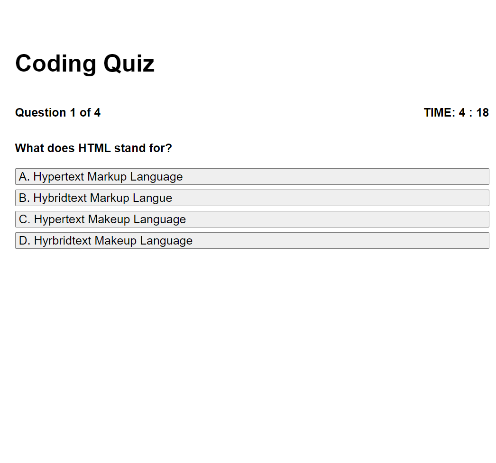

# Code-Quiz Description

This projects goal was to create a quiz on basic coding knowledge. The requirements were a start button which would start a timed quiz, questions with multiple choice answers, a time reduction penalty when a question is answered incorrectly, and the ability to save your highscore.

    -I created 3 htmls. 
        One for the start button page which contains the start button that references the page to the quiz page,
        One for the quiz page which contains the basic layout and the buttons for the the answers to the questions
        One for the highschore page youll be taken to after you select "Submit Highscore"(Still being worked on).
        With each having their own designated css. 

    -I created a main javascript(script.js) which is referenced in the quiz.html. This javascript is where I have the functions and classes to:
        Create the quiz,
        Create the questions on the quiz,
        Give funcionality to the progress and timer bar,
        Give functionality to the answer buttons to answer the questions,
        Add a point for every question answered correctly,
        Reduce the timer by a minute for every question answered incorrectly,
        Add additional HTML to the page when the quiz is finished or you run out of. This contains your score, a retake the quiz button, as well as a submit your highscore button.

    -I am still working on the highscore page and function. However, everything else is fully completed, interactive, and responsive

## Code-Quiz Screenshot

### Code-Quiz Github Link

(https://kjkhalil.github.io/Code-Quiz/)